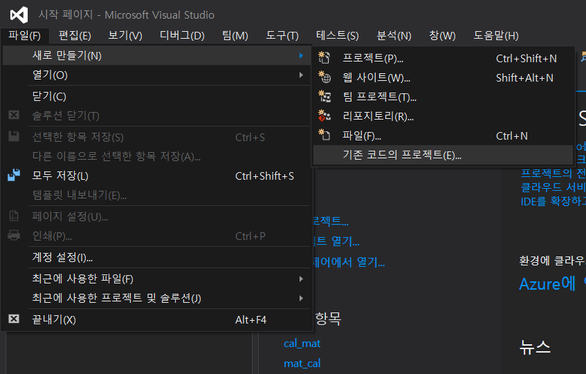
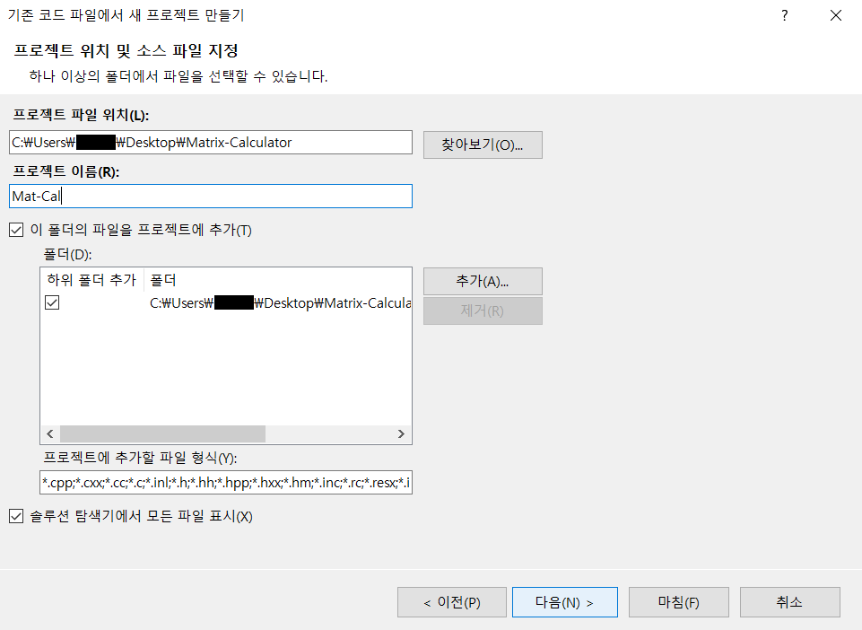
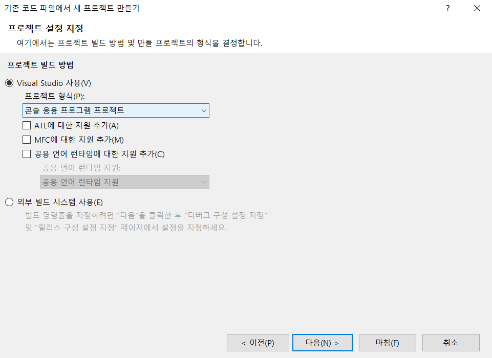
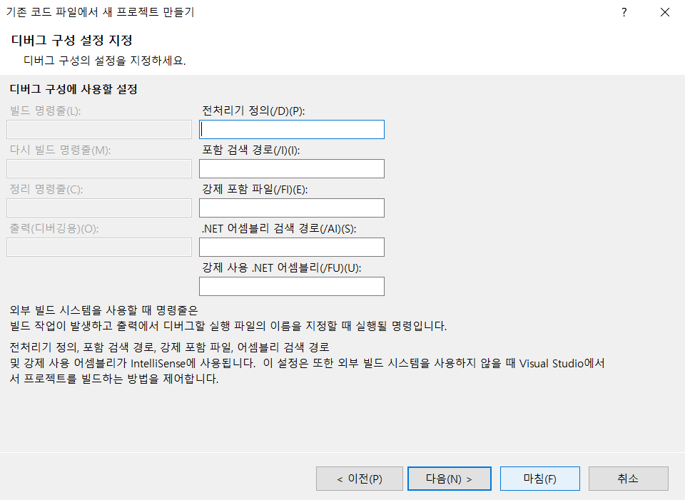
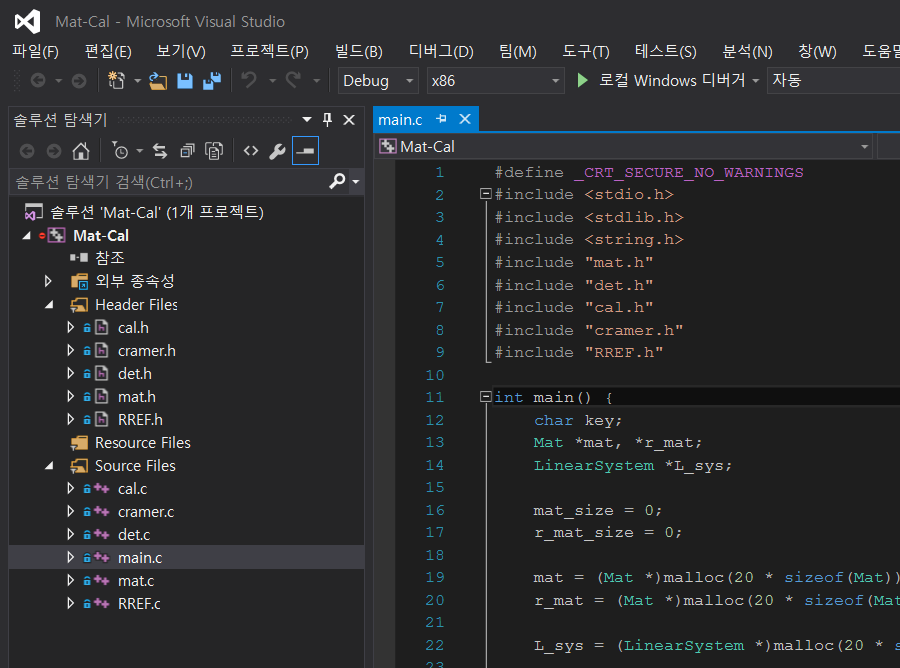

# Matrix-Calculator

파일 입출력 기반의 **행렬 계산기** 입니다. 각 연산은 Files 폴더 안의 .txt 파일에 입력된 행렬을 사용하며 간단한 콘솔 응용 프로그램으로 실행됩니다.

해당 계산기에서 지원하는 **연산 종류**는 다음과 같습니다.

* 행렬 입력 : 연산에 사용할 .txt 형식의 파일을 입력받고 생성합니다.
* 행렬 연산 : 행렬이 저장된 파일명과 연산식을 입력받고 그 결과를 도출합니다.
* 행렬식 계산 : 파일에 저장된 모든 행렬의 행렬식을 도출합니다.
* 해 찾기(Cramer's Rule) : Cramer's Rule을 이용하여 파일에 저장된 모든 행렬의 해를 도출합니다. 
* REF 또는 RREF 구하기 : 파일에 저장된 모든 행렬 각각의 REF와 RREF 형태를 출력합니다. 

## Development Environment

* OS : Windows 10
* Language : C
* Tool : Visual Studio 2015, Git Bash (v2.22.0.windows.1)

## Step By Step Execution

해당 프로젝트는 여러 방법으로 실행할 수 있습니다. 그 중 Git Bash를 통해 저장소와 연동하여 사용한 방법에 대해 자세히 설명합니다.<br>

**1. 저장소의 코드를 ZIP 파일로 다운받아 원하는 위치에 저장한 후 편집기에서 실행합니다.**

  저장소의 파일을 **올바른 위치**에 구분하는 것이 중요합니다. 저장소의 Files 폴더는 연산에 사용할 .txt 파일이 저장되므로 .c 파일과 .h 파일 바로 상단에 위치해야 합니다.<br>편집기에 따라 위치가 맞지 않는 경우 cramer.c, mat.c 파일의 ```char file_n[100] = "./Files/";``` 부분의 경로를 수정하여 올바른 경로로 설정하기 바랍니다.<br><br>
**2. 저장소를 clone 하여 실행합니다.**

저장소를 clone 하여 로컬 저장소와 연동한 후 실행합니다. 이 방법은 Git Bash, Visual Studio 2015를 기준으로 작성하였습니다.

2-1. Git Bash를 이용하여 원하는 위치에 다음 명령어를 작성합니다.

```
git clone https://github.com/1000peach/Matrix-Calculator.git
```

2-1. 물론 해당 저장소를 fork 한 저장소의 주소를 clone 해도 무방합니다. 

```
git clone [fork한 저장소 url]
```


2-2. Visual Studio를 실행한 후 [파일] - [새로 만들기] - [기존 코드의 프로젝트]를 클릭합니다.



2-3. 프로젝트 파일 위치는 전 단계에서 clone 받았던 폴더의 경로로 설정하고, 생성할 프로젝트의 이름을 입력한 후 [다음]을 클릭합니다.



2-4. 프로젝트 형식은 콘솔 응용 프로그램 프로젝트로 설정한 후 [다음]을 클릭합니다.



2-5. 디버깅 구성에서는 특별히 설정할 것이 없으므로 [마침]을 클릭합니다.



2-6. clone 받았던 기존 저장소의 소스 파일들이 구분되었고 프로젝트에 필요한 파일들이 추가되었습니다. 이제 자유롭게 코드를 편집하고 빌드할 수 있습니다. 또한 Git Bash를 통하여 프로젝트를 관리하고 원격 저장소와 연동할 수 있습니다.

## How To Use

* [행렬 입력](https://github.com/1000peach/Matrix-Calculator/wiki/Input)
* [행렬 연산](https://github.com/1000peach/Matrix-Calculator/wiki/Calculation)
* [행렬식 계산](https://github.com/1000peach/Matrix-Calculator/wiki/Determinant)
* [해 찾기](https://github.com/1000peach/Matrix-Calculator/wiki/Solution)
* [REF 또는 RREF 구하기](https://github.com/1000peach/Matrix-Calculator/wiki/REF-and-RREF)


> _과제로 제출한 간단한 프로그램이지만 README, Wiki 작성 연습을 위해 기본적인 내용을 작성했습니다._
